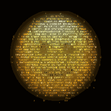

# Emoji2ASCII

Turn text, emoji, or a photo into a glowing field of ASCII characters, right in
your browser.

Type any text, add emoji, or upload an image and Emoji2ASCII rasterizes it, then
"paints" the shape with randomized text — in the source's real colors or a single
Matrix-style hue. You can hide words inside the noise, crank the contrast, and
export a shareable image, plain text, an animation, or a link that reproduces
your exact settings.

It's a single, dependency-free HTML file. No build step, no server, no tracking.

## Demo

Open [`index.html`](index.html) in any modern browser — that's it. The animation
above is a GIF exported straight from the app.

## Features

- **Text + emoji** — a multi-line text box you can type into (line breaks are
  kept and each line is centered), with a built-in emoji keyboard (10 categories)
  that inserts emoji at the caret. Everything is auto-sized to fill the canvas;
  turn on **word wrap** to also auto-wrap any single line that's too long.
- **Photo mode** — upload any image (a headshot works great) and it gets the same
  ASCII treatment; PNGs with transparency keep their silhouette.
- **Character sets** — Matrix mix, binary, katakana, block shades, or your own
  custom set of characters.
- **Two color modes** — use the source's original colors (emoji or photo), or
  switch to a single picked color with an automatically derived light→dark palette.
- **Contrast control** — pushes the dark areas darker (with a gentle lift on the
  brights) so shapes read with more punch.
- **Hidden text** — three text modes:
  - *Random characters* — classic Matrix noise.
  - *Spell out words* — your message flows through the shape, readable.
  - *Hidden words* — mostly random, with your words woven in horizontally.
- **Tunable look** — letter size, density, aura/glow strength, canvas size, and a
  seed for reproducible results (same seed → same image).
- **Auto-centered** — the emoji is recentered on its actual pixels, so every glyph
  lands dead-center regardless of its font metrics.
- **Export under 1 MB** — downloads a JPEG, stepping quality (and finally scale)
  down until it fits, so the file is always easy to share.
- **PNG + transparent background** — export a PNG, optionally with a transparent
  background for compositing.
- **Copy as text** — grab the render as plain text (the actual character grid),
  ready to paste anywhere monospace.
- **Share links** — every setting lives in the URL hash, so copying the link
  reproduces the exact image (photos excluded — they can't fit in a URL).
- **Animation** — a live "shimmer" preview that cycles seeds, plus a WebM/MP4
  export recorded straight off the canvas and an animated **GIF** export written
  by a built-in encoder (median-cut palette + LZW) — no extra libraries.

## Usage

1. Open `index.html` in a browser.
2. Pick an emoji from the ⌨️ keyboard or paste one into the box.
3. Adjust the sliders to taste; toggle **Use original colors** for color vs. mono.
4. (Optional) Set a **Text mode** and type a message to embed words.
5. Click **Download JPG** to save the image (always < 1 MB).

> Color and detail look best on systems with a color emoji font (e.g. Apple Color
> Emoji on macOS). On monochrome-emoji systems, the single-color mode works great.

## How it works

1. The chosen emoji is drawn to a small offscreen canvas and its pixels are read.
2. A tight bounding box of the non-transparent pixels is used to recenter and scale
   it into the main canvas.
3. The canvas is walked on a character grid; each cell samples the emoji bitmap —
   covered cells become glyphs colored from the pixel (or the palette), and a
   blurred copy of the silhouette drives a soft, shape-following glow and the
   scattered outer "aura" characters.

All rendering is plain Canvas 2D with a small seeded PRNG (`mulberry32`) for
reproducibility.

## License

[MIT](LICENSE)
